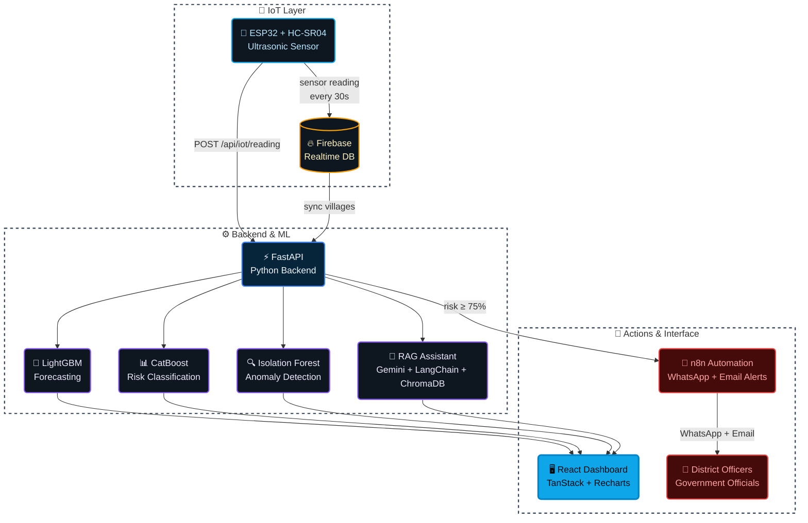
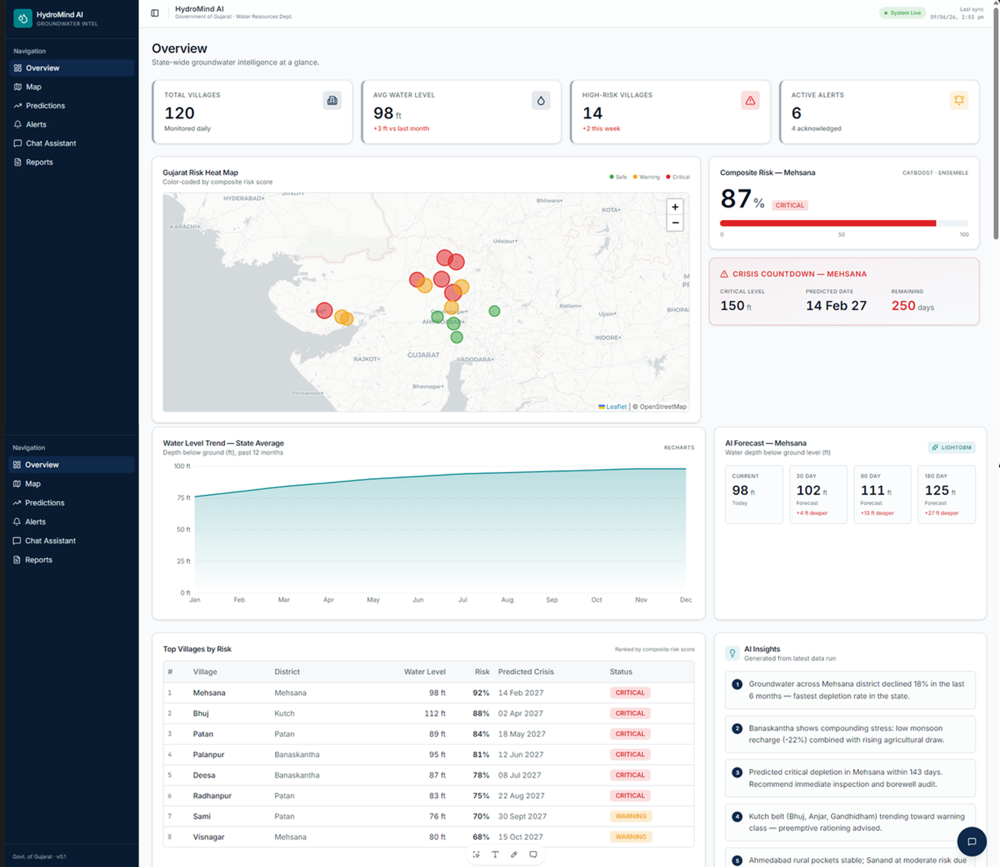
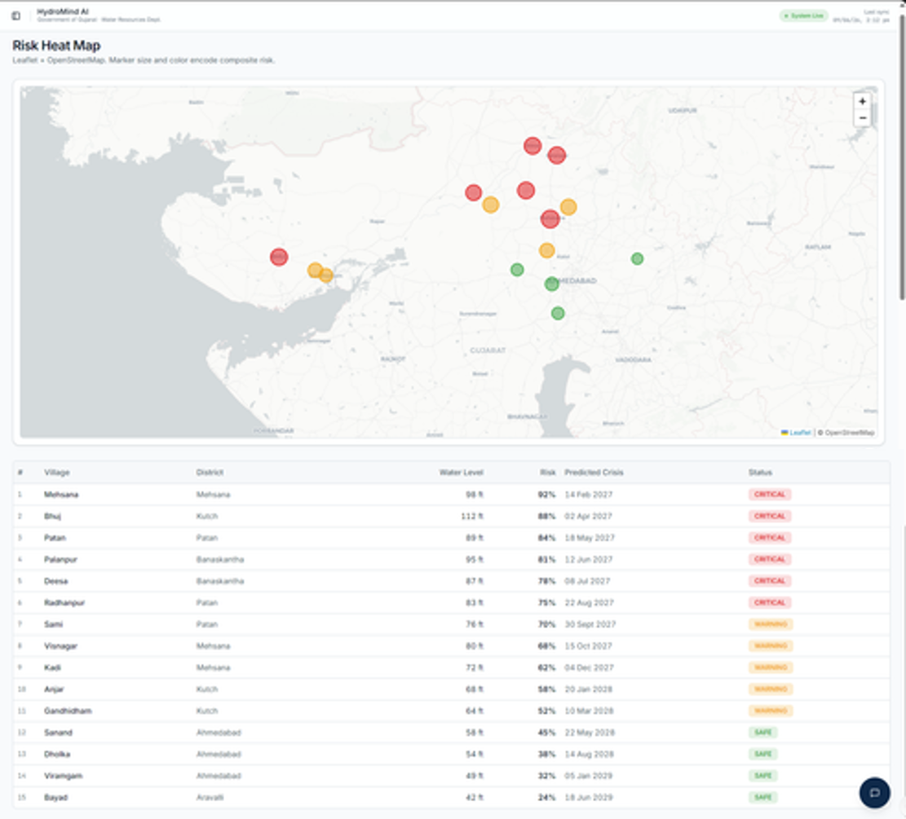
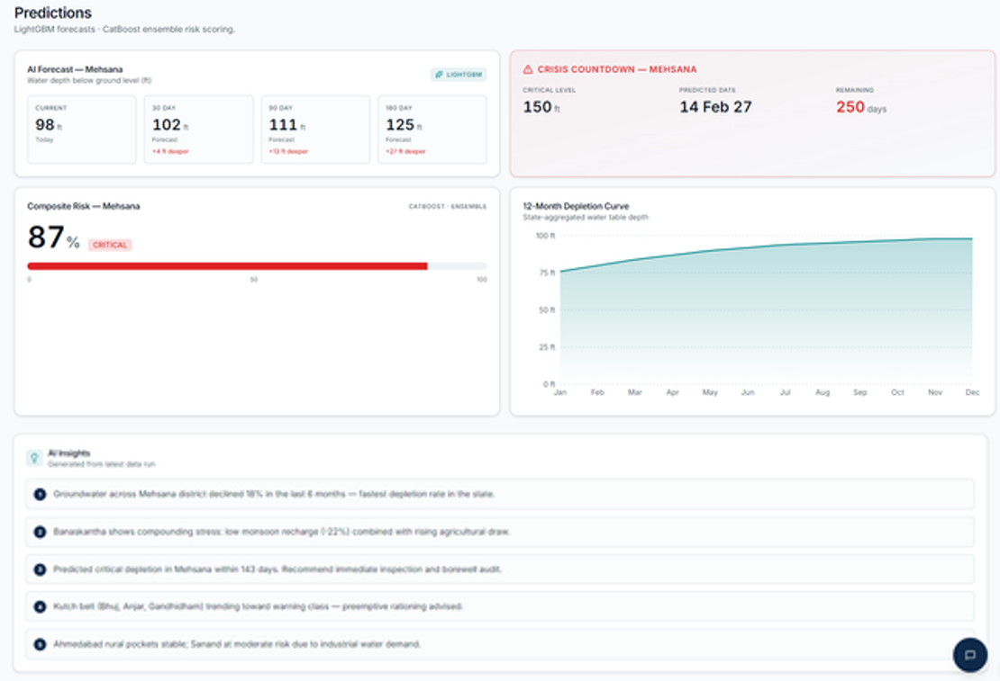
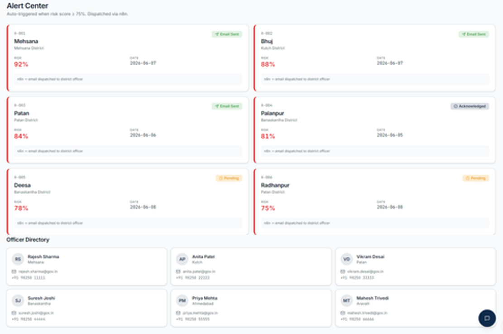
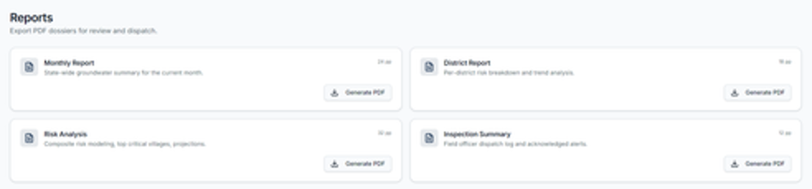

<div align="center">


<br/>

<a href="https://git.io/typing-svg"></a>

<br/>

<p>
  
  
  
</p>

<p>
  
  
  
  
  
  
  
  
</p>

<br/>

**[Dashboard Modules](#-dashboard-modules)** &nbsp;·&nbsp;
**[Architecture](#-architecture)** &nbsp;·&nbsp;
**[ML Models](#-ml-models)** &nbsp;·&nbsp;
**[Quick Start](#-quick-start)**

</div>

<br/>

---

## 🎯 Mission Brief

Over **120 villages** in Gujarat are depleting their aquifers faster than monsoon can replenish them. District officers get notified only when the borewell runs dry — too late to act.

**HydroMind AI** is a real-time groundwater intelligence platform that transforms raw IoT sensor data into **predictive, actionable decisions** for government officials. It answers the question that actually matters:

> *"Which villages will hit a water crisis first — and what should we do about it right now?"*

Built for **HackAarambh 2026**, it functions as a command-center decision tool powered by live ESP32 sensors, three production ML models, automated WhatsApp/email alerts, and a RAG AI assistant grounded on real village data.

<table>
<tr>
<td width="25%" align="center"><b>Monitor</b><br/><sub>Real-time IoT sensors in 120+ villages</sub></td>
<td width="25%" align="center"><b>Forecast</b><br/><sub>LightGBM 365-day water level predictions</sub></td>
<td width="25%" align="center"><b>Alert</b><br/><sub>Auto-dispatch via WhatsApp & email</sub></td>
<td width="25%" align="center"><b>Decide</b><br/><sub>RAG AI assistant grounded on live data</sub></td>
</tr>
</table>

---

## 🏗️ Architecture



**Data flow:** ESP32 sensors push water-depth readings every 30 seconds to Firebase and the FastAPI backend. Three ML models run inference — LightGBM forecasts future depth, CatBoost classifies risk category, and Isolation Forest flags anomalies. The React dashboard consumes all outputs in real time. When risk crosses threshold, n8n fires WhatsApp + email alerts to named district officers.

---

## 🧠 Core Innovation — Composite Risk Score

Every village receives a **Composite Risk Score (0–100)** computed from live sensor data and ML inference:

```
Risk = f( water_level, depletion_trend_6mo, rainfall, temperature, season )
```

| Risk Category | Score | CatBoost Label | Dashboard State |
|---|---|---|---|
| ✅ Safe | 0–49 | `safe` | 🟢 Green |
| ⚠️ Semi-Critical | 50–74 | `semi-critical` | 🟡 Yellow |
| 🔴 Critical | 75–84 | `critical` | 🔴 Red |
| 💀 Over-Exploited | 85–100 | `over-exploited` | 🔴 Red + Alert dispatched |

*When a village crosses **75%**, n8n auto-triggers a WhatsApp message and email to the responsible district officer within seconds.*

---

## 🖥️ Dashboard Modules

| Module | Route | Function |
|---|---|---|
| 🗺️ **Overview** | `/` | State-wide KPIs, Gujarat heat map, LightGBM forecast panel, AI insights |
| 📍 **Risk Map** | `/map` | Spatial village risk map colour-coded by composite score |
| 📈 **Predictions** | `/predictions` | Per-village forecast + risk meter + crisis countdown |
| 🚨 **Alerts** | `/alerts` | Alert dispatch status, officer directory, n8n integration |
| 💬 **AI Chat** | `/chat` | RAG assistant (Gemini + ChromaDB) grounded on live village data |
| 📄 **Reports** | `/reports` | PDF generation — monthly, district, risk analysis, inspection reports |

---

## 📸 Screenshots

<div align="center">

<table>
<tr>
<td width="50%" align="center" valign="top">
<b>Overview Dashboard</b><br/><br/>

</td>
<td width="50%" align="center" valign="top">
<b>Gujarat Risk Map</b><br/><br/>

</td>
</tr>
<tr>
<td width="50%" align="center" valign="top">
<b>AI Predictions & Forecasts</b><br/><br/>

</td>
<td width="50%" align="center" valign="top">
<b>Alerts & Dispatch</b><br/><br/>

</td>
</tr>
<tr>
<td width="50%" align="center" valign="top">
<b>RAG AI Assistant Chat</b><br/><br/>

</td>
<td width="50%" align="center" valign="top">
<b>Automated Reports</b><br/><br/>

</td>
</tr>
</table>

</div>

---

## 🤖 ML Models

| Model | Algorithm | Task | Output |
|---|---|---|---|
| **Forecasting** | LightGBM Regressor | Predict water depth at 30/90/180/365 days | Water level in ft |
| **Risk Classification** | CatBoost Classifier | Classify village risk category | `safe` / `semi-critical` / `critical` / `over-exploited` |
| **Anomaly Detection** | Isolation Forest | Flag sudden drops & abnormal extraction | Anomaly score 0–1 |

Train all three: `python -m app.ml.train` (auto-triggers on first backend start if models are missing)

---

## 📡 API Reference

| Method | Endpoint | Description |
|---|---|---|
| `GET` | `/api/health` | Health check |
| `GET` | `/api/villages` | All monitored villages with live data |
| `GET` | `/api/villages/totals` | State-wide KPI aggregates |
| `GET` | `/api/predictions/forecast/{id}` | LightGBM 30/90/180/365-day forecast |
| `GET` | `/api/predictions/risk/{id}` | CatBoost risk classification + confidence |
| `GET` | `/api/predictions/anomalies` | Isolation Forest anomaly scores |
| `GET` | `/api/predictions/crisis/{id}` | Days-to-crisis countdown |
| `GET` | `/api/alerts` | Active alert log |
| `POST` | `/api/alerts/dispatch` | Manually trigger n8n alert |
| `POST` | `/api/iot/reading` | Ingest live ESP32 sensor reading |
| `POST` | `/api/chat` | RAG assistant query → Gemini response |

Interactive docs: **http://localhost:8000/docs**

---

## 🛠️ Tech Stack

<div align="center">

<table>
<tr><th>Layer</th><th>Stack</th></tr>
<tr>
<td><b>Frontend</b></td>
<td>


</td>
</tr>
<tr>
<td><b>Backend</b></td>
<td>


</td>
</tr>
<tr>
<td><b>ML / AI</b></td>
<td>


</td>
</tr>
<tr>
<td><b>IoT</b></td>
<td>


</td>
</tr>
<tr>
<td><b>Infrastructure</b></td>
<td>


</td>
</tr>
</table>

</div>

---

## ⚡ Quick Start

### 1. Frontend (React Dashboard)

```bash
npm install
cp .env.example .env        # set VITE_API_URL=http://localhost:8000/api
npm run dev
```

Open **http://localhost:5173** · Falls back to mock data if backend is offline.

### 2. Backend (FastAPI + ML)

```bash
cd backend
python -m venv .venv
.venv\Scripts\activate          # Windows
# source .venv/bin/activate     # macOS / Linux
pip install -r requirements.txt
cp .env.example .env            # add GEMINI_API_KEY + Firebase creds
python run.py                   # models auto-train on first start
```

API docs: **http://localhost:8000/docs**

### 3. Enable AI Chat (RAG)

Add to `backend/.env`:

```env
GEMINI_API_KEY=your_key_from_aistudio.google.com
```

Restart backend — ChromaDB initialises automatically and chat switches from rule-based to `rag-gemini`.

### 4. WhatsApp / Email Alerts (n8n)

```bash
# 1. Import the workflow
n8n import:workflow --input=n8n/hydromind-alert-workflow.json

# 2. Set webhook URL in backend/.env
N8N_WEBHOOK_URL=https://your-n8n.app/webhook/hydromind-alerts
```

Alerts fire automatically when `riskScore ≥ 75%` or `anomalyScore ≥ 0.8`.

### 5. IoT (ESP32 + HC-SR04)

```
Firmware: iot/hydromind_esp32/hydromind_esp32.ino
```

1. Wire `HC-SR04` → GPIO 12 (TRIG) / 13 (ECHO)
2. LEDs → GPIO 25 (Red) / 26 (Green) / 27 (Yellow) · Buzzer → GPIO 14
3. Set `WIFI_SSID`, `WIFI_PASS`, `FIREBASE_AUTH`, `API_URL` in the sketch
4. Flash via Arduino IDE — sensor pushes readings every **30 seconds**

| LED State | Meaning |
|---|---|
| 🟢 Green | Safe (water level ≤ 80 ft) |
| 🟡 Yellow | Warning (80–120 ft) |
| 🔴 Red + Buzzer | Critical (> 120 ft) |

---

## 📂 Repository Structure

```
HydroMind-AI/
│
├── src/                          # React dashboard (TanStack Start)
│   ├── components/               # KPI cards, forecast panel, map, chatbot…
│   ├── routes/                   # index, map, predictions, alerts, chat, reports
│   └── lib/
│       ├── api/                  # API client + React Query hooks
│       └── mock-data.ts          # Offline fallback data
│
├── backend/                      # FastAPI + ML + RAG
│   └── app/
│       ├── ml/                   # LightGBM, CatBoost, Isolation Forest
│       ├── routers/              # /villages, /predictions, /alerts, /chat, /iot
│       └── services/             # Firebase, n8n dispatcher, RAG (Gemini)
│
├── iot/
│   └── hydromind_esp32/
│       └── hydromind_esp32.ino   # Arduino firmware
│
├── n8n/
│   └── hydromind-alert-workflow.json
│
├── render.yaml                   # Render deployment config
├── vercel.json                   # Vercel deployment config
└── README.md
```

---

## 🚀 Deployment

| Component | Platform | Config |
|---|---|---|
| Frontend | Vercel | `vercel.json` |
| Backend + ML | Render | `render.yaml` |
| Realtime DB | Firebase Realtime Database | `backend/.env` |

---

## ⚠️ Honest Limitations

- ML models are trained on **synthetic CGWB-style data** — production deployment requires real historical district records
- `gemini-2.0-flash-lite` free tier has daily quota limits; adding a billing account removes this restriction
- ESP32 demo covers **1 physical sensor node** — production would use LoRaWAN or GSM for remote villages
- Firebase sync is best-effort; sensor data older than 30s may lag in high-load conditions

<div align="center">

### Predict. Alert. Prevent. — Before the last borewell runs dry.

<br/>


<sub>Built for HackAarambh 2026 · Government of Gujarat Water Resources Dept.</sub>

</div>
